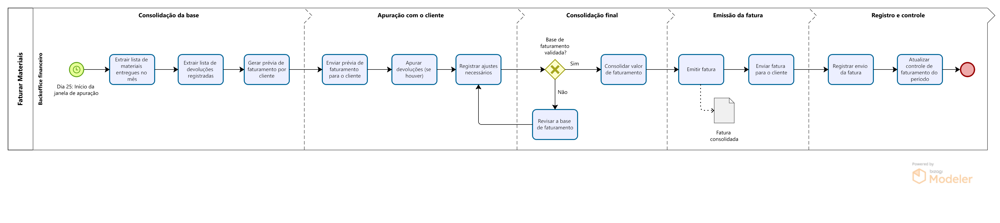

# Processo de Faturamento de Materiais — Modelagem BPMN

Modelo de processo desenvolvido em **BPMN** para representar o fluxo de faturamento mensal de materiais, desde a consolidação da base até o registro e controle do faturamento.

O objetivo do modelo é ilustrar, de forma estruturada, as etapas necessárias para garantir a **apuração correta dos valores faturados**, incluindo validação com o cliente, tratamento de divergências e emissão da fatura.

---

## Estrutura do Processo

---

## Etapas do Processo

O processo foi organizado em cinco macroetapas para facilitar a compreensão do fluxo operacional.

### 1. Consolidação da base
Nesta etapa são coletadas as informações necessárias para o faturamento:

- Extração da lista de materiais entregues no mês
- Extração das devoluções registradas
- Geração da prévia de faturamento por cliente

---

### 2. Apuração com o cliente
Após a geração da prévia, ocorre a validação com o cliente:

- Envio da prévia de faturamento
- Apuração de devoluções ou divergências
- Registro de ajustes necessários

---

### 3. Consolidação final
Nesta fase é realizada a validação da base de faturamento:

- Verificação se a base está validada
- Revisão da base em caso de inconsistências
- Consolidação do valor final de faturamento

---

### 4. Emissão da fatura

Após a consolidação dos valores:

- Emissão da fatura
- Envio da fatura ao cliente

O modelo inclui um **artefato de documento BPMN** representando a fatura consolidada.

---

### 5. Registro e controle

Etapa final de governança do processo:

- Registro do envio da fatura
- Atualização do controle de faturamento do período

---

## Ferramenta Utilizada

- **Bizagi Modeler**
- Padrão **BPMN 2.0**

---

## Objetivo do Projeto

Este projeto foi desenvolvido como parte de um portfólio voltado à **modelagem de processos de negócio**, com foco em:

- padronização de processos
- melhoria de clareza operacional
- identificação de pontos de controle
- apoio à gestão e governança dos fluxos de trabalho

---

## Observação

Este modelo representa um **processo simplificado**, criado para fins de demonstração e portfólio.

---

## Autora

**Gabriela Cerqueira**

Profissional com experiência em **gestão de processos, melhoria contínua e gestão de ativos**, com atuação em análise de dados, Business Intelligence e modelagem de processos para apoio à tomada de decisão.

